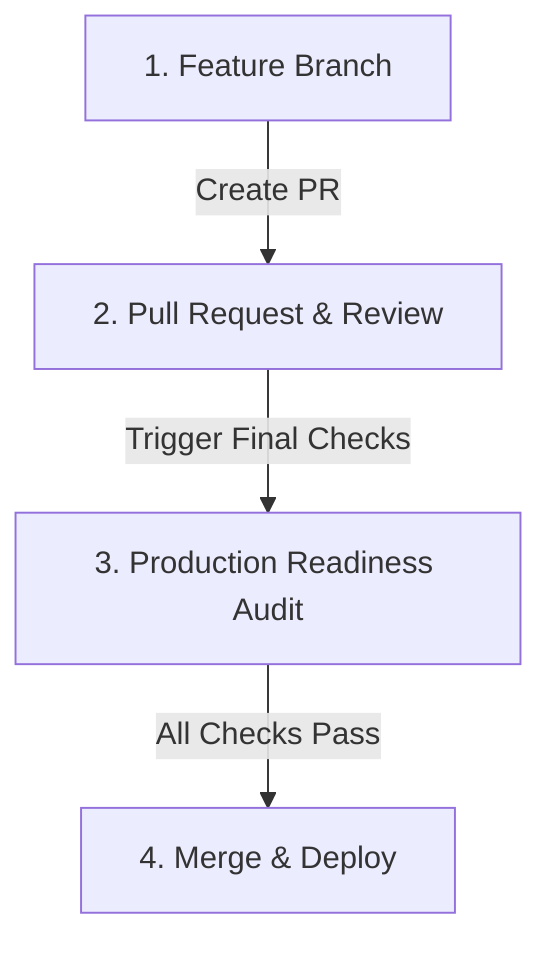

# 🚀 PropertyStack Feature Release & Quality Assurance Workflow

This document explains the standard workflow for promoting changes, verifying production readiness, and writing release notes before deploying features to the live environment.

---

## 📋 1. The Standard Release Pipeline

All new features and fixes must go through this three-step lifecycle:



### Step 1: Open a Pull Request (PR)
* Create a dedicated feature branch for your changes (e.g. `feat/landlord-routing`).
* Open a Pull Request to merge the branch into `main`.
* GitHub will automatically pre-fill the description using the [.github/pull_request_template.md](.github/pull_request_template.md).

### Step 2: Audit Production Readiness
Run the automated verification checks to ensure the application is stable, secure, and regression-free (see Section 2).

### Step 3: Compile Release Notes
Draft the release log detailing exactly what is being added, updated, or fixed in user-facing language. Once merged, append this to [RELEASE_LOG.md](RELEASE_LOG.md) and [RELEASE_NOTES.md](RELEASE_NOTES.md).

---

## 🛡️ 2. Verification & Audit Tools

We have automated verification scripts in the `.agent/` directory to check quality guidelines:

| Check | Automated Script | Manual CLI Command |
| :--- | :--- | :--- |
| **Security Scan** | `.agent/skills/vulnerability-scanner/scripts/security_scan.py` | `python3 .agent/skills/vulnerability-scanner/scripts/security_scan.py <dir>` |
| **Lint & Quality** | `.agent/skills/lint-and-validate/scripts/lint_runner.py` | `python3 .agent/skills/lint-and-validate/scripts/lint_runner.py <dir>` |
| **Test Runner** | `.agent/skills/testing-patterns/scripts/test_runner.py` | `python3 .agent/skills/testing-patterns/scripts/test_runner.py <dir>` |
| **UX & Access** | `.agent/skills/frontend-design/scripts/ux_audit.py` | `python3 .agent/skills/frontend-design/scripts/ux_audit.py <dir>` |
| **Mobile Audit** | `.agent/skills/mobile-design/scripts/mobile_audit.py` | `python3 .agent/skills/mobile-design/scripts/mobile_audit.py <dir>` |

To run all checks together:
```bash
python3 .agent/scripts/checklist.py .
```

---

## 🤖 3. How to Trigger the AI Agent Checklist

Before merging a PR or deploying to production, you can trigger the AI coding agent to perform all validations automatically. 

### Trigger Phrases
Simply type any of the following phrases in your chat session:
* **`final checks`**
* **`run final checklist`**
* **`run all tests`**
* **`son kontrolleri yap`**

### What the Agent Will Do:
1. **Run Automation**: The agent will run the complete checklist suite.
2. **Flag Blockers**: It will intercept any critical security holes or compilation errors.
3. **Format Scorecard**: It will output a passing/failing status card.
4. **Draft release logs**: It will auto-generate the PR description/release note entries for you.
